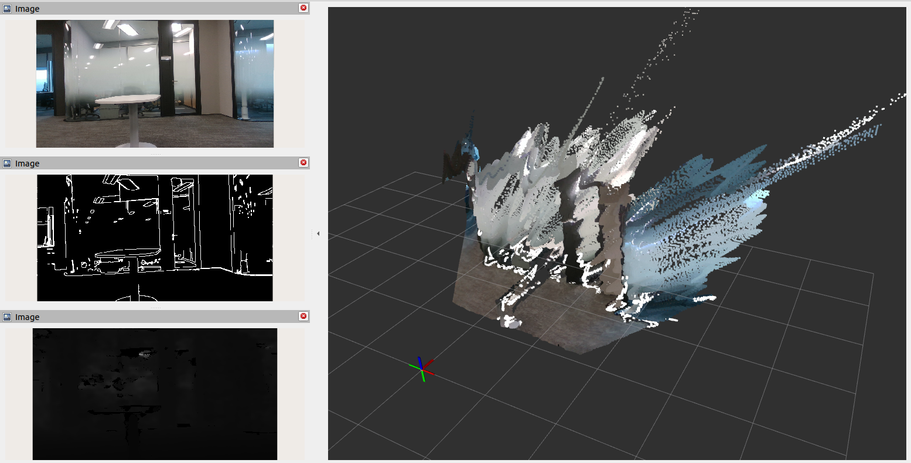

# REALSENSE-ROS-ALIGNEDGE

Please refer to the official guideline to know the basic [realsense-ros](./realsense-ros//README.md) functions.

## Dependencies

<details>
  <summary>
    Step 1: Install ros2(ubuntu), libopencv-dev, ros-cv-bridge
  </summary> 

- #### Ubuntu 22.04:
  - [ROS2 Iron](https://docs.ros.org/en/iron/Installation/Ubuntu-Install-Debians.html)
  - [ROS2 Humble](https://docs.ros.org/en/humble/Installation/Ubuntu-Install-Debians.html)
  #### Ubuntu 20.04
	- [ROS2 Foxy](https://docs.ros.org/en/foxy/Installation/Ubuntu-Install-Debians.html)
</details>

<details>
  <summary>
    Step 2: Install latest Intel&reg; RealSense&trade; SDK 2.0
  </summary>

  **Please choose only one option from the 3 options below (in order to prevent multiple versions installation and workspace conflicts)**

- #### Option 1: Install librealsense2 debian package from Intel servers
  - Jetson users - use the [Jetson Installation Guide](https://github.com/IntelRealSense/librealsense/blob/master/doc/installation_jetson.md)
  - Otherwise, install from [Linux Debian Installation Guide](https://github.com/IntelRealSense/librealsense/blob/master/doc/distribution_linux.md#installing-the-packages)
    - In this case treat yourself as a developer: make sure to follow the instructions to also install librealsense2-dev and librealsense2-dkms packages
  
- #### Option 2: Install librealsense2 (without graphical tools and examples) debian package from ROS servers (Foxy EOL distro is not supported by this option):
  - [Configure](http://wiki.ros.org/Installation/Ubuntu/Sources) your Ubuntu repositories
  - Install all realsense ROS packages by ```sudo apt install ros-<ROS_DISTRO>-librealsense2*```
    - For example, for Humble distro: ```sudo apt install ros-humble-librealsense2*```

- #### Option 3: Build from source
  - Download the latest [Intel&reg; RealSense&trade; SDK 2.0](https://github.com/IntelRealSense/librealsense/releases/tag/v2.53.1)
  - Follow the instructions under [Linux Installation](https://github.com/IntelRealSense/librealsense/blob/master/doc/installation.md)
</details>

## Installation

1. Clone to your workspace and build
   ```sh
   git clone https://github.com/lightinfection/realsense-ros-alignEdge.git
   colcon build
   ```
2. Setup [parameters](./camera_edge/launch/camera_edge.launch.py)
    
    #### **Main realsense-ROS parameters (not polished, for all parameters, please refer to realsense-ros pkg as well)**

    * `serial_no` - [string]  
    Serial number of the realsense camera    
    * `rgb_camera.color_profile` - [string]  
    Width * Height * FPS of RGB stream    
    * `depth_module.color_profile` - [string]  
    Width * Height * FPS of depth stream   
    * `enable_depth` - [bool]  
    Enable depth module  
    Default value: `true`
    * `enable_color` - [bool]  
    Enable RGB stream  
    Default value: `true`
    * `enable_sync` - [bool]  
    Enable synchronizing the ros time stamps of the topics for `color, depth, aligned_color_to_depth` streams    
    Default value: `true`
    * `align_depth.enable` - [bool]  
    Enable aligning FOVs of depth and rgb streams   
    Default value: `true`
    * `pointcloud.enable` - [bool]  
    Enable directly converting depth information to pointcloud and publishing   
    Default value: `false`

    #### **Camera_edge parameters for publishing pointcloud**

    * `frame_id` - [string]  
    ROS tf frame of the realsense camera in the world frame   
    Default value: `camera_link`
    * `frame_height` - [int]  
    The minimal row number of aligned_depth_rgb image   
    Default value: `1`
    * `frame_bottom` - [int]   
    The maximal row number of aligned_depth_rgb image   
    Default value: `720`
    * `min_range` - [double]  
    The lower range (depth) threshold of the object to camera in real world   
    Default value: `0.0`
    * `max_range` - [double]   
    The upper range (depth) threshold of the object to camera in real world   
    Default value: `10.0`
    * `min_height` - [double]  
    The lower relative height threshold of the object to camera in real world   
    Default value: `-2.0`
    * `max_height` - [double]   
    The upper range (depth) threshold of the object to camera in real world   
    Default value: `2.0`

    #### **Camera_edge parameters for publishing edge image**

    * `edge_type` - [int]  
    Edge extration method implemented by OpenCV, 0 - Sobel_Derivatives, 1 - Laplace_Operator, 2 - Canny_Edge_Detector   
    Default value: `0`
    * `apply_blur_pre` - [bool]  
    If apply gaussian blur before edge extraction   
    Default value: `true`
    * `apertureSize` - [int]   
    Kernel size of the Gaussian blur before edge extraction    
    Default value: `3`
    * `apply_blur_post` - [bool]  
    If apply gaussian blur after edge extraction   
    Default value: `false`
    * `postBlurSize` - [int]   
    Kernel size of the Gaussian blur after edge extraction   
    Default value: `3`
    * `postBlurSigma` - [double]  
    Standard deviation of the Gaussian on both x and y directions after edge extraction   
    Default value: `3.2`
    * `canny_threshold1` - [int]   
    Lower threshold value in Hysteresis Thresholding, for Canny only   
    Default value: `100`
    * `canny_threshold2` - [int]   
    Upper threshold value in Hysteresis Thresholding, for Canny only   
    Default value: `200`
    * `L2gradient` - [bool]   
    If using L2 norm for gradient calculation, for Canny only   
    Default value: `false`
    * `morph_iteration` - [int]   
    Iterations of the closing operation after edge binarization. If 0, then skip   
    Default value: `1`
    * `apply_erode` - [bool]   
    If executing eroding operation once before publishing image   
    Default value: `false`

    #### **Subscription and Publication**

    * `/camera/color/image_rect_raw` - [sensor_msgs::msg::Image]  
    Subscription on raw rgb color stream (rgb8) for edge_detection    
    * `/camera/aligned_depth_to_color/image_rect_raw` - [sensor_msgs::msg::Image]  
    Subscription on aligned_depth_to_color stream (mono16) for obtaining the FOV transformation between stereos   
    (todo: Develop transformation function based on rs2::align() rather than by ros topic subscription)
    * `/camera/depth/camera_info` - [sensor_msgs::msg::CameraInfo]  
    Subscription on the depth stream for the intrinsic matrix of the depth camera   
    * `/camera/depth/image_edge` - [sensor_msgs::msg::Image]  
    Publication of the binarized edges (mono8) of rgb color stream    
    * `/camera/depth/border/points` - [sensor_msgs::msg::PointCloud2]  
    Publication of the pointclouds on edges in roi (specified by parameters, such as `min_range`, `frame_height` .etc)   

3. Start by launch file
   ```sh
   source install/setup.bash
   ros2 launch camera_edge camera_edge.launch.py
   ```

    
  